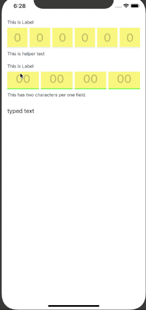

# CodeField


[](https://cocoapods.org/pods/CodeField)
[](https://cocoapods.org/pods/CodeField)
[](https://cocoapods.org/pods/CodeField)
[](https://codebeat.co/projects/github-com-brownsoo-codefield-master)

## Now in developing

Api can be changed in future. 

- [ ] Storyboard integration test
- [ ] Code documentation
- [ ] Add properties for styling


## Example



To run the example project, clone the repo, and run `pod install` from the Example directory first.

## Requirements

## Installation

CodeField is available through [CocoaPods](https://cocoapods.org). To install
it, simply add the following line to your Podfile:

```ruby
pod 'CodeField'
```

## Author

brownsoo, hansune@me.com

## License

CodeField is available under the MIT license. See the LICENSE file for more info.
